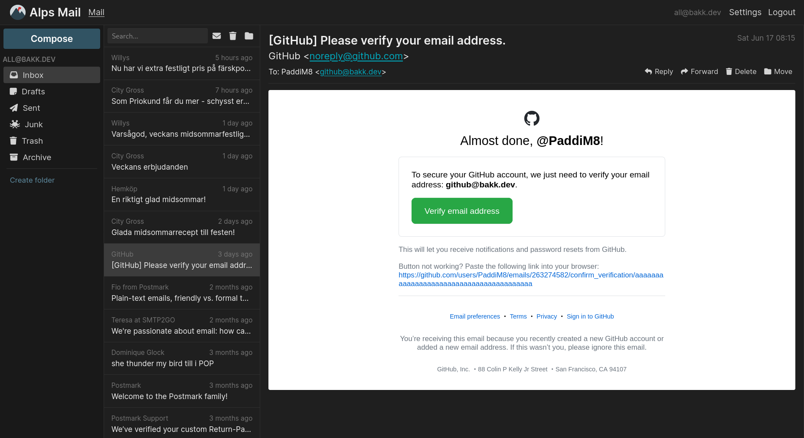

# Alps Neo

Alps Neo is a theme and a fork of the [Alps webmail client](https://git.sr.ht/~migadu/alps), with a modern design.



## Prerequisites

* node
* npm
* go
* a mail server

## Installation

```sh
git clone https://github.com/PaddiM8/alps
cd alps/
git clone https://github.com/PaddiM8/alps-neo themes/neo
cd themes/neo
npm install
npm run dist
```

## Run

```sh
# from the 'alps' directory
go run ./cmd/alps -theme sane imaps://mx.example.org:imap-port smtp://mx.example.org:smtp-port
```
